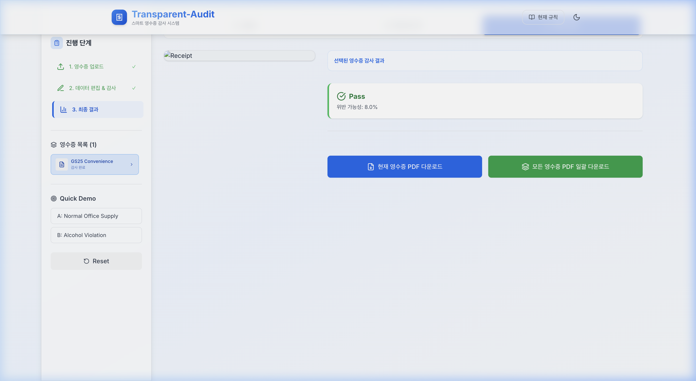
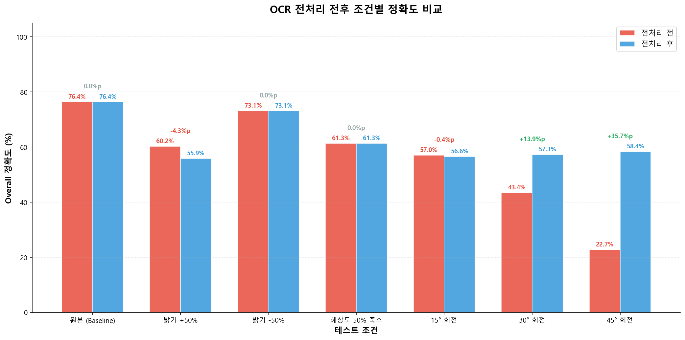
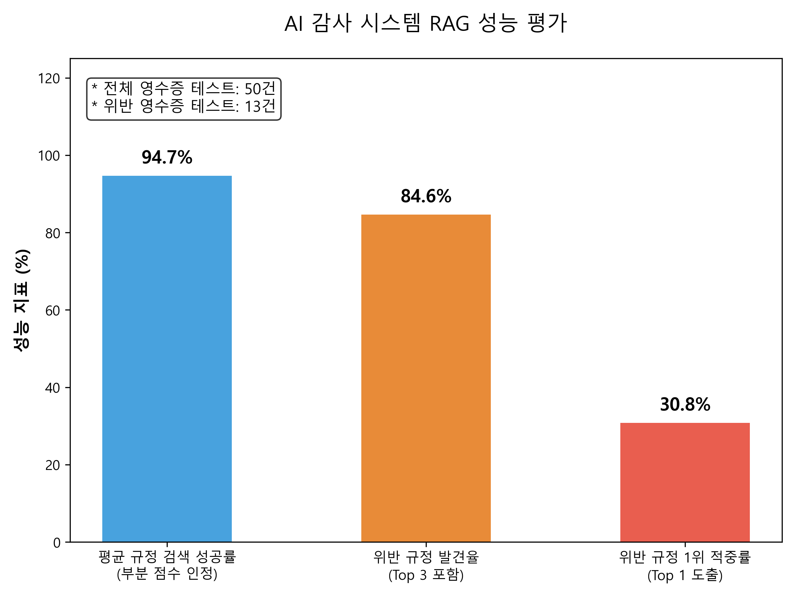
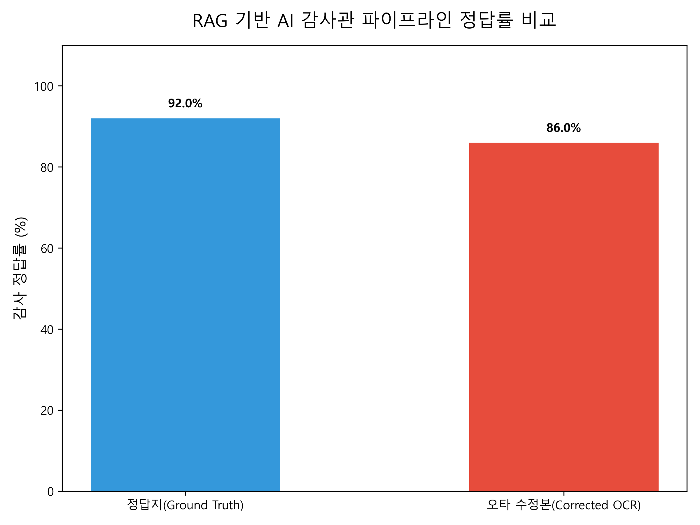
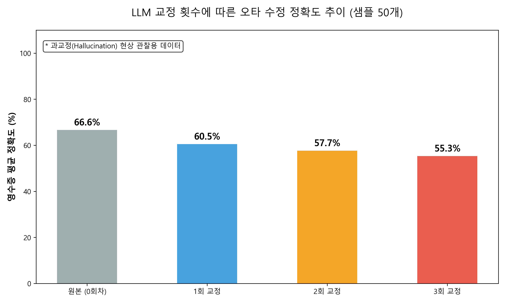

# 🧾 Transparent-Audit

> **Smart Receipt Audit System for Organizational Accounting Transparency**

Transparent-Audit is a pipeline-based automated audit system designed to monitor and detect financial policy violations from receipt images. By combining OCR text extraction, pre-processing/skew correction, Vector DB-based Retrieval-Augmented Generation (RAG), and a LLM-based reasoning agent, Transparent-Audit automatically checks transactions against complex organizational rules and outputs detailed compliance reports.

## 🖥️ System Interface / UI Demo



---

## 🌟 Key Features & Pipeline Workflow

1. **Receipt OCR & Pre-processing**: Auto-rotates, corrects skew, and extracts raw receipt text (Merchant Name, Timestamp, Items, Prices, Total Amount) using PaddleOCR.
2. **Regulation Search (RAG)**: Searches the vector database (ChromaDB) to fetch contextually relevant clauses from the organization's policy PDF.
3. **AI Auditing Agent**: A LangChain-driven agent processes the extracted receipt data alongside the retrieved regulations to detect compliance anomalies (e.g., late-night purchases, restricted merchant categories, unallowable personal expenses).
4. **PDF Report Generation**: Compiles the audit verdict, risk score, specific policy violations, and reasoning into a downloadable compliance PDF.

---

## 📁 Repository Directory Structure

```
.
├── core/                               # Core Business Logic & Pipelines
│   ├── audit_agent/                    # LLM-based Auditor Agent & prompts
│   │   ├── reasoning.py                # Main reasoning agent logic
│   │   └── test/                       # Agent auditing & proofreading benchmarks
│   ├── ocr_engine/                     # OCR & Pre-processing engines
│   │   ├── paddle_wrapper.py           # PaddleOCR helper with Skew Correction
│   │   ├── processor.py                # Receipt parser (regex & structured output)
│   │   └── test/                       # OCR robustness benchmarks
│   ├── rag_engine/                     # RAG Engine (Vector DB, Embeddings)
│   │   ├── embedder.py                 # PDF document parser and splitter
│   │   ├── vector_db.py                # ChromaDB vector store wrapper
│   │   └── rag_test/                   # RAG search relevance benchmarks
│   └── report_engine/                  # PDF audit report generator
├── server/                             # Backend API (FastAPI)
│   ├── routes/                         # API routers and endpoints
│   └── services/                       # Business logic services
├── web-react/                          # Frontend SPA (React + TypeScript + Vite + TailwindCSS)
│   ├── src/                            # Components, state hooks, and API clients
│   ├── package.json                    # Frontend dependencies
│   └── tailwind.config.js              # Tailwind styling configuration
├── data/                               # Data & File Storage
│   ├── raw/                            # Original rules/policy PDFs & receipts
│   ├── intermediate/                   # Cache files (OCR JSONs, SQLite database)
│   └── output/                         # Generated compliance reports (PDFs)
├── dev.sh                              # High-performance quickstart script (uv powered)
├── docker-compose.yml                  # Containerized deployment script
├── backend.Dockerfile                  # Docker configuration for FastAPI server
├── frontend.Dockerfile                 # Docker configuration for React client
├── requirements.txt                    # Project-wide Python dependencies
└── README.md                           # Main project documentation
```

---

## 🚀 Getting Started & Setup Instructions

### 1. Prerequisites
- **Python**: Version 3.9 or higher
- **Node.js**: Version 18 or higher (for local frontend execution)
- **uv**: Optional, but highly recommended for fast dependency resolution (https://github.com/astral-sh/uv)
- **Docker**: For running services inside containers

### 2. Environment Configuration
Create a `.env` file in the root directory. You can base it on the following configuration:
```env
# Upstage LLM API Key (Required for Agent & Ingestion)
UPSTAGE_API_KEY=your_upstage_api_key_here

# Backend CORS & API URLs (Local default)
FRONTEND_URL=http://localhost:3000,http://localhost
API_URL=http://localhost:8000
VITE_API_BASE_URL=http://localhost:8000
```

### 3. Initialize Regulation Database (RAG)
Place your organization's policy PDF file in `data/raw/organization_policy.pdf` and run:
```bash
python -m core.rag_engine.ingest
```
*This parses the PDF, splits it into clause-level chunks, and indexes them into Chroma Vector DB.*

### 4. Running the Application

#### Option A: Quickstart Script (Recommended)
If you have `uv` installed, you can launch the backend and frontend simultaneously in one command:
```bash
chmod +x dev.sh
./dev.sh
```
- **Frontend**: http://localhost:3000
- **Backend**: http://localhost:8000
- **Logs**: Monitor via `tail -f backend.log` or `tail -f frontend.log`

#### Option B: Step-by-Step Manual Run

##### Step 1: Run the Backend
```bash
# Create and activate virtual environment
python -m venv .venv
source .venv/bin/activate  # On Windows: .venv\Scripts\activate

# Install dependencies
pip install -r requirements.txt

# Launch FastAPI server
PYTHONPATH=. uvicorn server.routes.app:app --host 0.0.0.0 --port 8000 --reload
```

##### Step 2: Run the Frontend
```bash
cd web-react
npm install
npm run dev -- --port 3000
```
Visit http://localhost:3000 in your browser.

#### Option C: Running with Docker Compose
To run the entire stack within containerized environments:
```bash
docker-compose up --build
```
- **Frontend**: http://localhost:80
- **Backend**: http://localhost:8000

---

## 📊 Performance Evaluation & Analysis Results

The system has been evaluated across three distinct categories: OCR Robustness, RAG search precision, and the AI Auditor pipeline accuracy. Below are the key results.

### 1. OCR Robustness Benchmark
This benchmark evaluates how various image augmentations (brightness changes, resolution degradation, and rotations) impact the OCR parser's field accuracy. It highlights the critical impact of the **preprocessing skew-correction engine**.

Testing was performed on **20 sample receipts** under 7 conditions.

#### OCR Accuracy Table

| Image Augmentation | Without Skew Correction (Field Acc / Perfect Receipts) | With Skew Correction (Field Acc / Perfect Receipts) | Performance Gain |
| :--- | :---: | :---: | :---: |
| **Original (Baseline)** | 76.4% (1/20) | 76.4% (1/20) | Baseline |
| **Brightness +50%** | 60.2% (0/20) | 55.9% (0/20) | -4.3% |
| **Brightness -50%** | 73.1% (1/20) | 73.1% (1/20) | 0.0% |
| **Resolution 50% Scale** | 61.3% (0/20) | 61.3% (0/20) | 0.0% |
| **15° Rotation** | 57.0% (0/20) | 56.6% (0/20) | -0.4% |
| **30° Rotation** | 43.4% (0/20) | 57.3% (0/20) | **+13.9%** |
| **45° Rotation** | 22.7% (0/20) | 58.4% (1/20) | **+35.7%** |

#### Key Takeaway (OCR)
Without skew correction, rotation degradation leads to a complete breakdown in accuracy (dropping to **22.7%** at 45°). Enabling the **preprocessing skew-correction engine** stabilizes field accuracy around **56% - 58%**, proving highly robust against misaligned uploads.



---

### 2. RAG Retrieval Performance
Evaluated using a dataset of **50 test receipt items** containing **13 true compliance anomalies** (violations) to evaluate the Vector Database's ability to fetch the correct regulatory clauses.

* **Mean Recall (Average Query Success)**: **94.7%** (RAG successfully retrieves relevant clauses for standard queries).
* **Top 3 Anomaly Rule Recall**: **84.6%** (The actual violated regulation clause is present in the top 3 RAG results for **11 out of 13** anomalies).
* **Top 1 Anomaly Rule Recall**: **30.8%** (The violated clause appears as the #1 search result in **4 out of 13** instances).

#### Key Takeaway (RAG)
RAG successfully retrieves the correct policy clauses with **94.7%** accuracy. For receipts that contain actual anomalies, retrieving the **Top 3 clauses** ensures the regulatory context is passed to the AI Auditor **84.6%** of the time.



---

### 3. AI Auditor & Pipeline Accuracy
The full audit pipeline (RAG context retrieval + LLM decision-making) was evaluated on **50 receipts** to compare its accuracy when supplied with clean human-annotated ground truth data versus parsing directly from corrected OCR outputs.

* **Auditing Accuracy (Ground Truth Input)**: **92.0%** (46 / 50 correct decisions).
* **Auditing Accuracy (Corrected OCR Input)**: **86.0%** (43 / 50 correct decisions).

#### Key Takeaway (Auditing Pipeline)
The system achieves a highly reliable **86.0%** end-to-end decision accuracy using raw image uploads with OCR parser outputs, compared to a **92.0%** upper bound when human annotation is used.



---

### 4. Over-Correction (Hallucination) Analysis
To determine if multi-iteration LLM "proofreading" of raw OCR output improves auditing performance, we benchmarked receipt accuracy across 3 sequential correction steps.

* **Baseline (Original Raw OCR)**: **66.6%** accuracy
* **Iteration 1**: **60.5%** accuracy
* **Iteration 2**: **57.7%** accuracy
* **Iteration 3**: **55.3%** accuracy

#### Key Takeaway (Over-Correction)
Adding successive proofreading cycles actually **degrades** structured receipt accuracy (dropping from **66.6%** down to **55.3%**). This is primarily driven by **LLM Hallucinations (Over-Correction)**, where the model invents items or normalizes non-existent noise. Thus, **a single correction pass (or direct classification) is optimal**.


